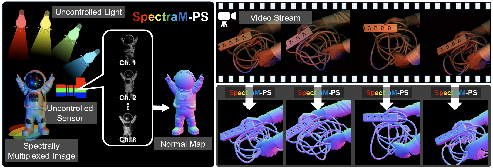

🚀 # SpectraM-PS-ECCV2024
Project Website for Physics-Free Spectrally Multiplexed Photometric Stereo under Unknown Spectral Composition (ECCV2024, Oral Presentation)
📄 [arXiv](https://arxiv.org/abs/2410.20716)
<div align="center">
  
</div>

<div align="center">

[](https://www.youtube.com/watch?v=UnySzHtMw9k)


</div>

---

## 📝 Overview

One-shot photometric stereo using spectral multiplexing technique under unknown spectral composition. 

## 🔧 Installation
Source codes is almost mainteined.

## 🔧 Dataset
Source codes is almost mainteined.

## 📚 Citation

If you find this work useful, please consider citing our paper:

```bibtex
@inproceedings{ikehata2025physicsfree,
  title     = {Physics-Free Spectrally Multiplexed Photometric Stereo under Unknown Spectral Composition},
  author    = {Ikehata, Satoshi and Asano, Yusuke},
  booktitle = {Proceedings of the European Conference on Computer Vision (ECCV)},
  year      = {2025},
  pages     = {295--312}
}
